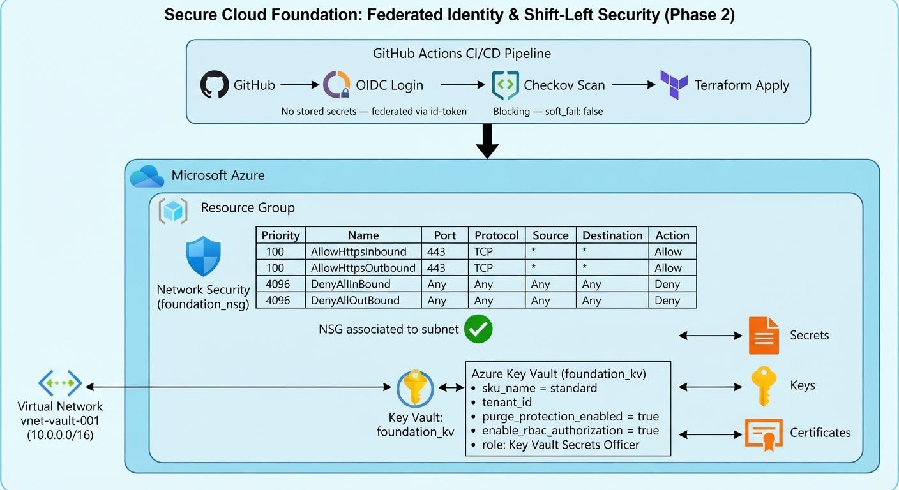
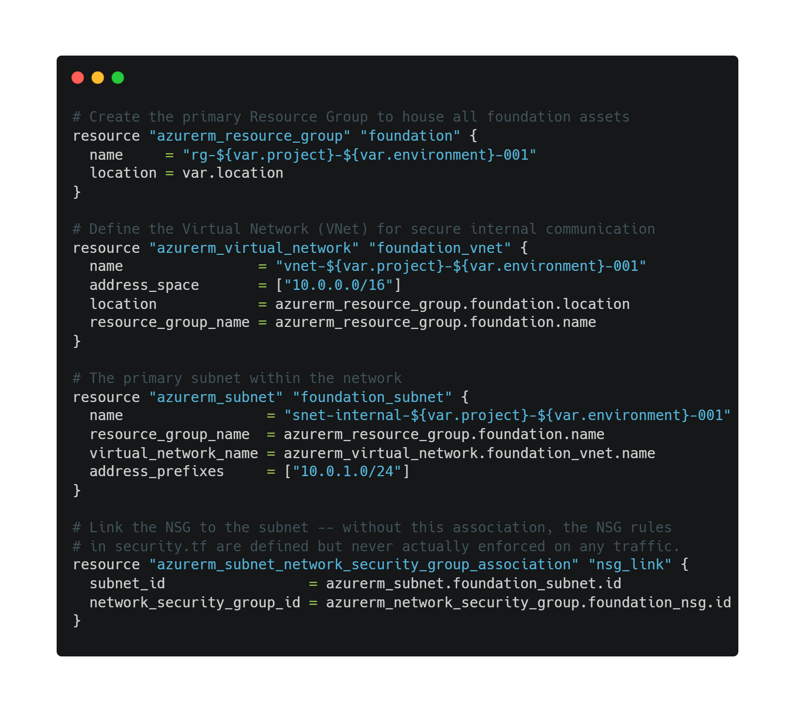
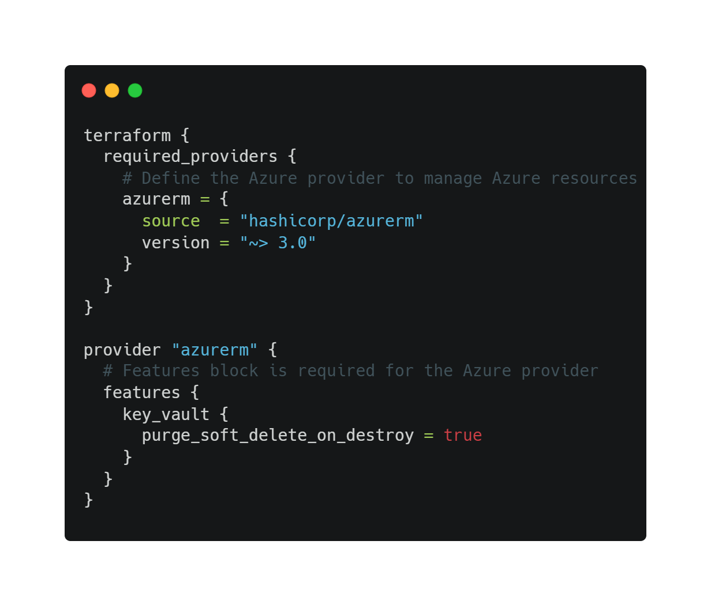
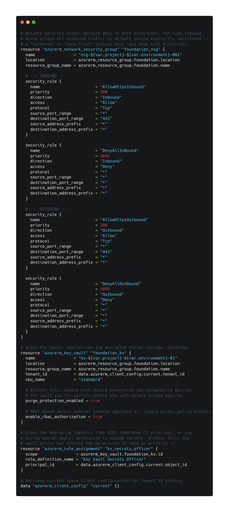
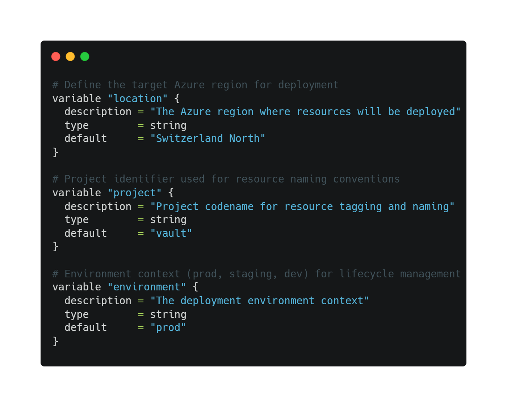
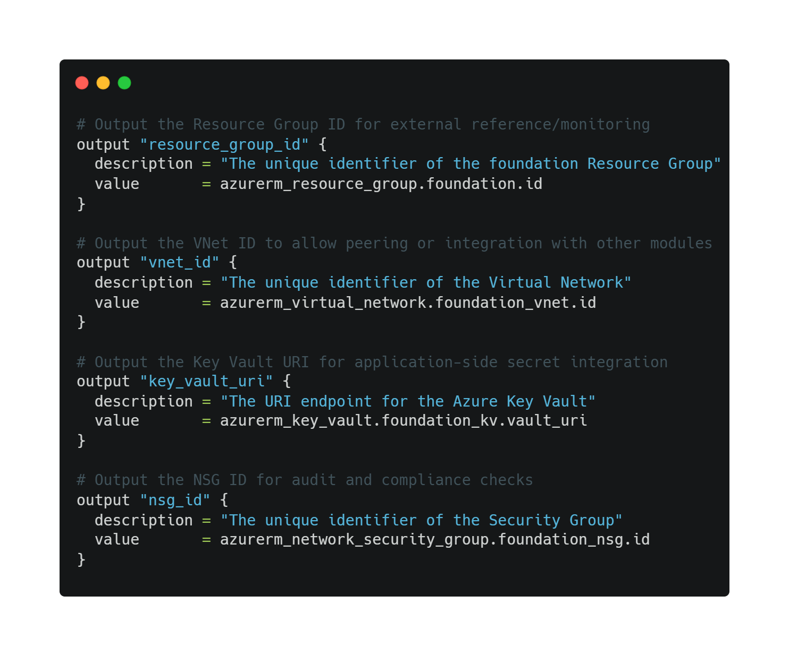

# Secure Cloud Foundation: Identità Federata e Sicurezza Shift-Left (Fase 2)

**Leggi in:** [English](README.md) | [Español](README.es.md) | [Italiano](README.it.md)

## 🎯 Panoramica
**Secure Cloud Foundation** è la **Fase 2** di un portfolio di sicurezza Azure in 3 parti, costruito direttamente su [Project Vault](https://github.com/luis-troccoli/project-vault) (Fase 1). Dove la Fase 1 ha stabilito i fondamentali — rete segmentata, un Key Vault hardened con RBAC — questa fase colma due lacune che la Fase 1 aveva lasciato come elementi di roadmap: credenziali statiche in CI e assenza di scansione di sicurezza automatizzata.

## 💡 Cosa Aggiunge Questo Progetto
* **Identità federata (OIDC):** la pipeline CI/CD si autentica su Azure tramite federazione OIDC di GitHub Actions — nessun segreto di service principal a lunga durata memorizzato da nessuna parte.
* **Un security gate reale e bloccante:** Checkov viene eseguito su ogni push/PR con `soft_fail: false`. Se trova una configurazione critica errata, la pipeline si ferma prima che `plan` o `apply` vengano eseguiti.
* **Una pipeline di deployment reale:** a differenza della Fase 1 (solo validazione), questa pipeline esegue `terraform plan` e `terraform apply` contro una subscription Azure reale sui merge verso `main`.
* **Lo stesso hardening della Fase 1**, portato avanti: regole NSG in entrambe le direzioni, Key Vault con purge protection e controllo degli accessi basato su RBAC tramite un'assegnazione di ruolo esplicita.

## 🏗️ Diagramma dell'Architettura

## 🛡️ Cosa È Realmente Implementato
* **Federazione OIDC:** `azure/login@v2` si autentica usando i permessi `id-token: write` — nessun `AZURE_CLIENT_SECRET` o equivalente memorizzato nei GitHub Secrets.
* **Checkov, bloccante:** `soft_fail: false` significa che un rilevamento critico fa fallire il job direttamente, prima che venga pianificata qualsiasi modifica all'infrastruttura.
* **Key Vault, hardened:** `purge_protection_enabled = true`, `enable_rbac_authorization = true`, più un'assegnazione esplicita del ruolo `Key Vault Secrets Officer` per l'identità che effettua il deployment.
* **NSG, entrambe le direzioni:** regole allow esplicite per HTTPS (443) in entrata e in uscita, con una regola deny-all di chiusura su ciascuna direzione.
* **Associazione NSG-subnet:** l'NSG è realmente collegato alla subnet — un'associazione che mancava in una bozza precedente di questo progetto e che avrebbe lasciato le regole dell'NSG definite ma mai applicate ad alcun traffico.

## 🔍 Analisi dei Componenti
### 1. `main.tf` — Orchestrazione

* Resource Group, VNet, subnet e l'associazione NSG-subnet.

### 2. `providers.tf` — Confine di Fiducia

* Dichiara il provider `azurerm`. L'autenticazione vera e propria avviene tramite OIDC nella pipeline CI/CD, non tramite credenziali statiche in questo file.

### 3. `security.tf` — Hardening

* Regole NSG (entrata + uscita, deny-all predefinito) e il Key Vault, inclusa la sua assegnazione RBAC.

### 4. `variables.tf` — Parametrizzazione

* Variabili di input (regione, ambiente, nome del progetto) con valori predefiniti sensati.

### 5. `outputs.tf` — Tracciabilità

* Espone l'ID del Resource Group, l'ID della VNet, l'URI del Key Vault e l'ID dell'NSG dopo il deployment.

---

## 🛠️ Tech Stack
* **Cloud:** Microsoft Azure (Resource Group, Key Vault con RBAC, Virtual Network, NSG, Entra ID/OIDC)
* **IaC:** HashiCorp Terraform (provider `azurerm` ~> 3.0)
* **Scansione di Sicurezza:** Checkov (bloccante, `soft_fail: false`)
* **CI/CD:** GitHub Actions con federazione OIDC
* **Controllo Versione:** Git (GitHub)

## 🤖 Pipeline CI/CD

La pipeline esegue, in ordine: login OIDC → `terraform init` → `terraform fmt -check` → `terraform validate` → scansione di sicurezza Checkov (bloccante) → `terraform plan` → `terraform apply` (solo su `main`). Un errore in qualsiasi step ferma la pipeline prima che venga eseguito il successivo.

## 📈 Roadmap (proseguito nella Fase 3)
* **Azure Policy:** monitoraggio continuo della compliance — risolto in [FinTech-Guard-OS](https://github.com/luis-troccoli/fintech-guard-os) (Fase 3).
* **Backend remoto:** Azure Storage Account con state locking, per il lavoro collaborativo.
* **Struttura modulare:** refactoring da file `.tf` piatti a `/modules` — risolto nella Fase 3.

## 🚀 Guida al Deployment
1. Configura le credenziali federate OIDC nella tua Azure AD app registration e nei secrets del repository GitHub (`AZURE_CLIENT_ID`, `AZURE_TENANT_ID`, `AZURE_SUBSCRIPTION_ID`).
2. Effettua il push su un feature branch e apri una PR — la pipeline valida e scansiona automaticamente.
3. Esegui il merge su `main` per attivare `plan` + `apply`.
4. `terraform destroy` una volta terminato, per evitare costi indesiderati.

## 🤝 Contributi
Aperto a PR e discussioni di architettura da chiunque lavori nella cloud security.
